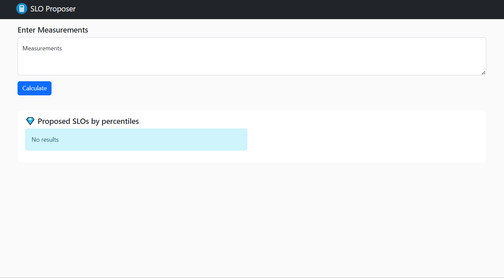

# SLO Proposer

Paste your measurements to figure if the average is consistent and proposed SLOs for specific percentiles.

```
yarn install
yarn start
```

Runs the app in the development mode.\
Open [http://localhost:3000](http://localhost:3000) to view it in your browser.


## Paste format

Measurements can be pasted with delimiters like comma, semicolon, pipe, tab, space, or newline.

## Check consistency with standard deviation 


## View proposed SLOs by percentile

